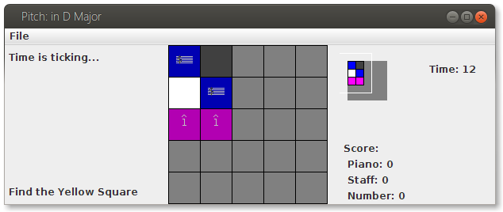
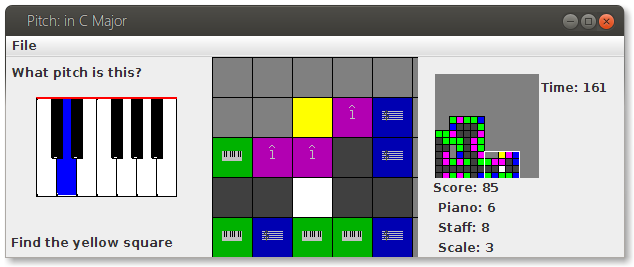
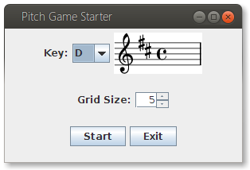
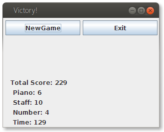

Pitch
=====

A music theory skills game that is actually a game.

Created for a final project in Java Gui class at Utah State University. Fulfills a dream of mine to make a really useful and enjoyable way to practice rote music theory skills. These are the most important skills, and really are a barrier to higher level music performance, composition, and appreciation. The game is most useful for people who already have a small foundation of musical knowledge but want to increase their skills. This game is effective because it helps practice the three most important non aural skills: reading music, translating that to a keyboard, and manipulating scales. When these foundation skills are super fast in every key, more complex musical analysis is easier. (think analyzing four part harmony for piano to guitar chords and transposing in real time, while singing and playing) 

How to Play
=====

The goal is to find the gold block within the time limit. The game is all about recognition. Each move requires recognizing some pitch.

Input and Program Flow
=====

The first screen is a setup screen, choose the desired key and gridsize. The key is what the note queries will be drawn from. For example, if you choose C, all the pitches you will be asked about will come from the C major scale (C, D, E, F, G, A, B). The grid, is a square, so the grid size refers to the length of the side of this square. Total squares = grid size squared.

The main game screen has three panels, the left is where you will be asked about pitches, the center shows your position on the grid, and the right one displays an overall map of the grid along with score information and the timer. Navigate the grid with the arrow keys, and input pitches with the corresponding letters on the keyboard (with s for sharp and b for flat, or alternately up arrow for sharp, down arrow for flat)

Upon running out of time or finding the gold block, the end game screen is shown, where you can review your score and exit or start a new game.

